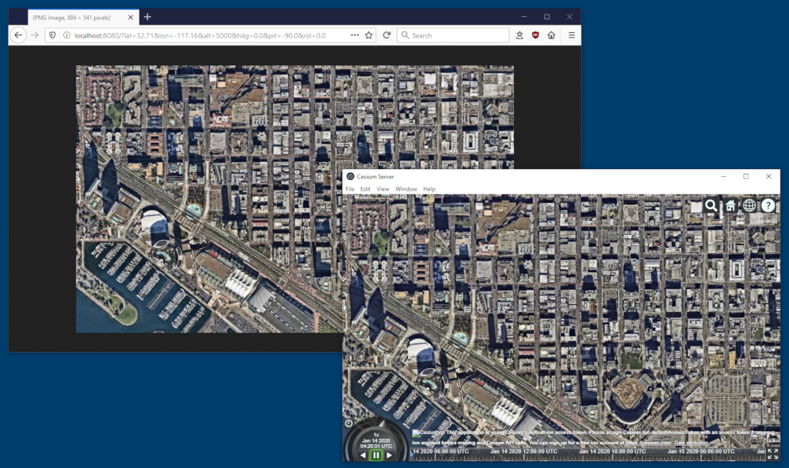

# Cesium Image Web Service

Provides a HTTP Web Service that allows a client to set the Cesium camera position and orientation and returns the resulting canvas image as PNG. Allows any application to leverage Cesium functionality through HTTP. Intended for single-client use only.



## Install dependencies and launch the web service
```shell
npm install
npm start
```

## Usage
### Query Parameters
lat : Latitude in degrees (required)  
lon : Longitude in degrees (required)  
alt : Altitude in meters (required)  
hdg : Heading in degrees (optional, defaults to 0.0)  
pit : Pitch in degrees (optional, defaults to -90.0)  
rol : Roll in degrees (optional, defaults to 0.0)  

### Example
```
http://localhost:8080/?lat=32.71&lon=-117.16&alt=5000&hdg=0.0&pit=-90.0&rol=0.0
```

## Known bugs
[Electron's executeJavaScript() does not resolve Promise or execute callback on Mac](https://github.com/electron/electron/issues/9073).
